# Standup Meeting Notes
> Notes for standups are listed in reverse chronological order
> (most recent at top)  
> Standups are held MWF @ 1:30pm on Discord  
> Template at bottom

---
## 03/27/2023 - Scrum Master: Carter Watson
### Team Notes
| Team Member   | Accomplishments from last standup | Plan for work until next standup | Roadblocks |
| ------------- | --- | --- | --- |
| Carter Watson | Worked on styling more | Style profile page, redo view cars page | Need more info on how and where profile page is put together |
| Caden Maxwell | Absent |  |  |
| Caleb Leavitt | Absent |  |  |
| Joseph Giles  | Working on manage inventory page for manager |  |  |
### Screenshot of Burndown Chart
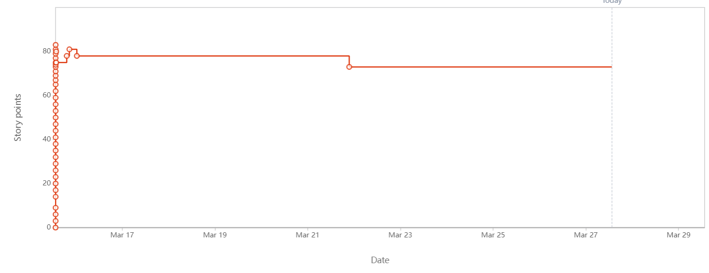
### Screenshot of Kanban Board
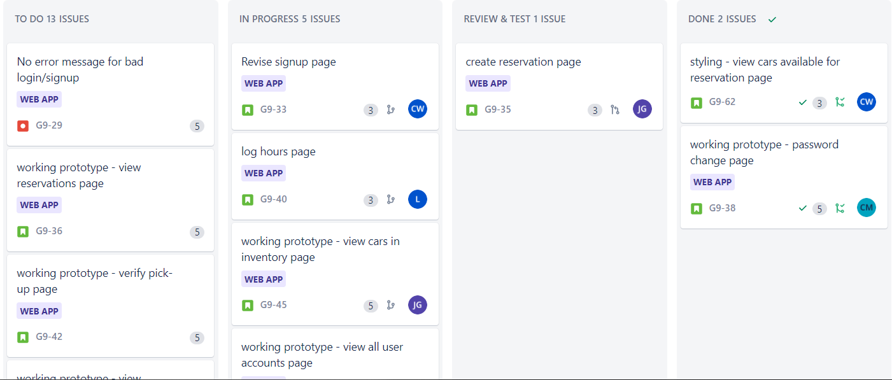
### Questions for team discussion
* None

---
## 03/24/2023 - Scrum Master: Carter Watson
### Team Notes
| Team Member   | Accomplishments from last standup | Plan for work until next standup | Roadblocks |
| ------------- | --- | --- | --- |
| Carter Watson | Absent | | |
| Caden Maxwell | Attended |  |  |
| Caleb Leavitt | Absent |  |  |
| Joseph Giles  | Attended |  |  |
### General Discussion
* Talking about create reservation page
* Caden got it figured out

---
## 03/22/2023 - Scrum Master: Carter Watson
### Team Notes
| Team Member   | Accomplishments from last standup | Plan for work until next standup | Roadblocks |
| ------------- | --- | --- | --- |
| Carter Watson | Styling | Continue styling | None |
| Caden Maxwell | Manager seeing users page, basic view up |  | None |
| Caleb Leavitt | Absent |  |  |
| Joseph Giles  | Working on creating reservation, checks against other reservations, creates error message |  | issues with multiple post requests from one view |
### Screenshot of Burndown Chart
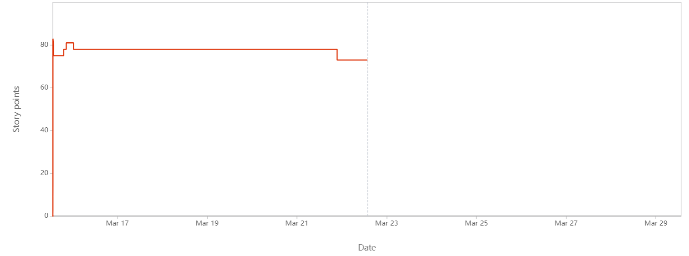
### Screenshot of Kanban Board
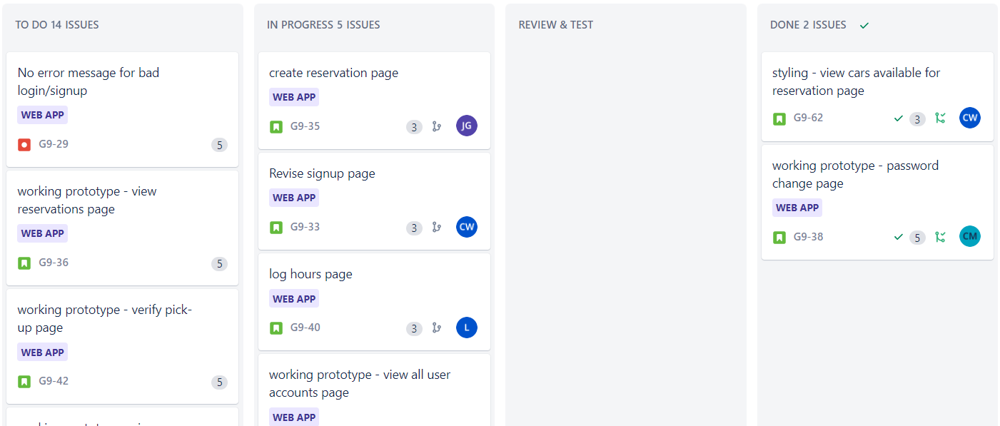
### Questions for team discussion
* None

---
## 03/20/2023 - Scrum Master: Carter Watson
### Team Notes
| Team Member   | Accomplishments from last standup | Plan for work until next standup | Roadblocks |
| ------------- | --- | --- | --- |
| Carter Watson | None | Styling Nav | None |
| Caden Maxwell | None | Working "currently checked out cars" | None |
| Caleb Leavitt | None | Working on styling | None |
| Joseph Giles  | Create reservation with date checks against other dates | Balance subtraction when user makes reservation | None |
### Screenshot of Burndown Chart
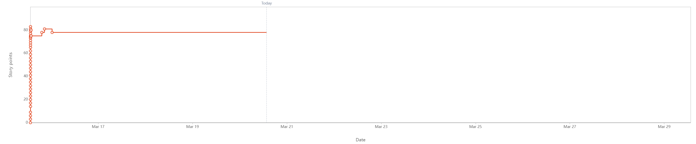
### Screenshot of Kanban Board
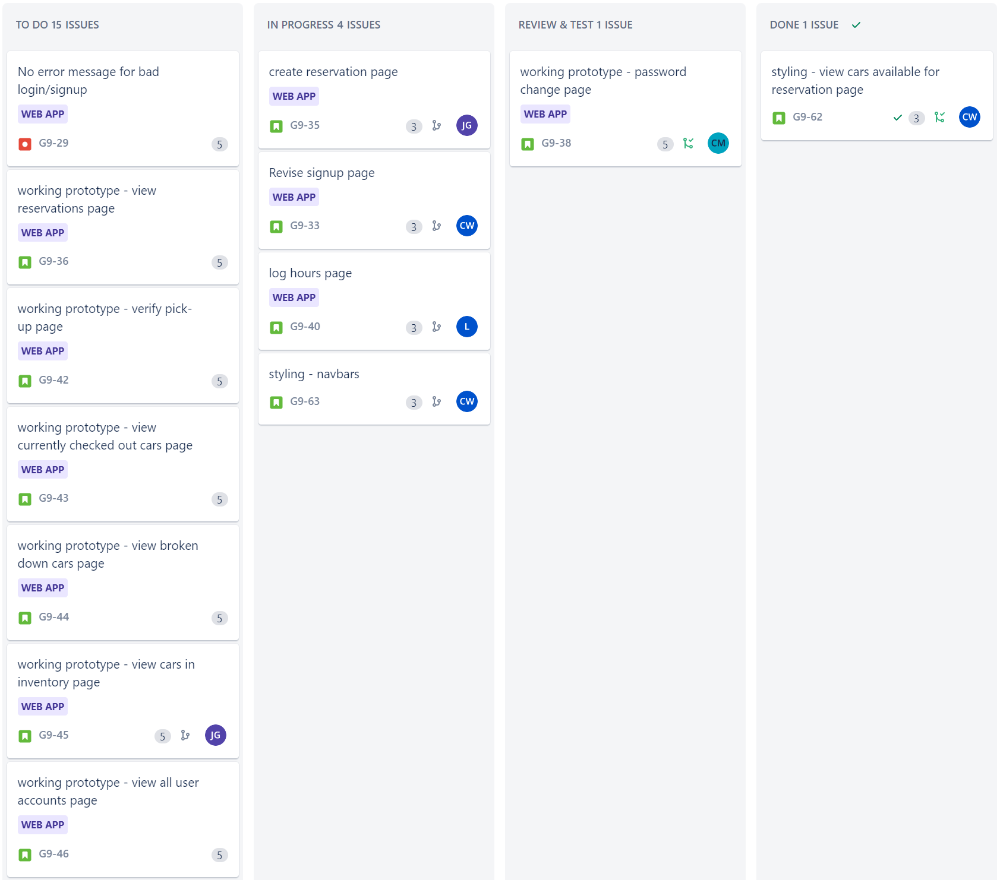
### Questions for team discussion
* None

---
## 03/15/2023 - Scrum Master: Carter Watson
### Team Notes
| Team Member   | Accomplishments from last standup | Plan for work until next standup | Roadblocks |
| ------------- | --- | --- | --- |
| Carter Watson | Prep'd tickets for next sprint | continue working on styling and UI/UX | None |
| Caden Maxwell |  |  |  |
| Caleb Leavitt | working on create reservation view | working on styling |  |
| Joseph Giles  | worked on reservaton process, created reservation model |  |  |
### Screenshot of Burndown Chart
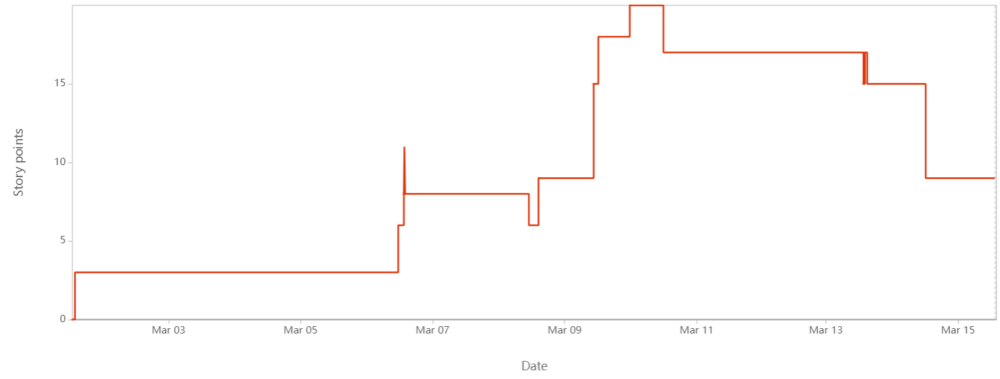
### Screenshot of Kanban Board
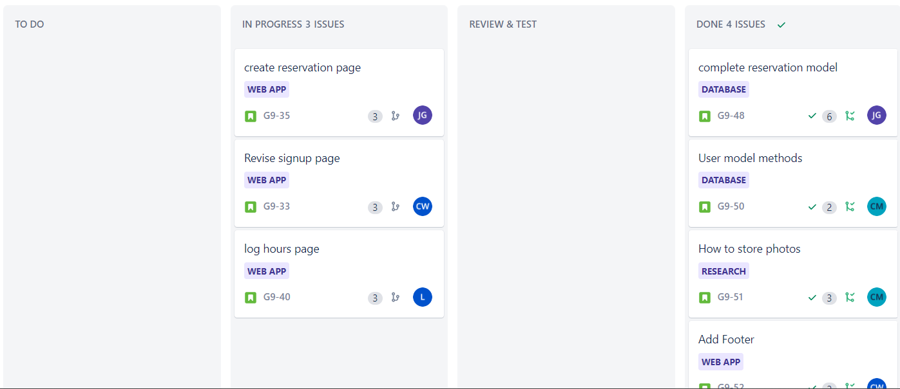
### Questions for team discussion
* Opinion on splitting work into styling and working prototypes

---
## 03/13/2023 - Scrum Master: Carter Watson
### Team Notes
| Team Member   | Accomplishments from last standup | Plan for work until next standup | Roadblocks |
| ------------- | --- | --- | --- |
| Carter Watson | Created Logo, added footer | work on putting together an effective sprint | None |
| Caden Maxwell | Worked on getting profile page to work, setup staff page - accessed by employeea and manager view changes for authLevel | Open to helping out | None |
| Caleb Leavitt | got stuck on redirect |  working on backlog, making pages | Talk with someone about the implementation stuff that was missed |
| Joseph Giles  | was stuck on migration files, working on create reservation page | filter by date for reservation | how to implement user filtering by date |
### Screenshot of Burndown Chart
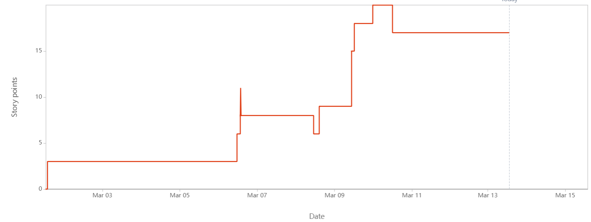
### Screenshot of Kanban Board
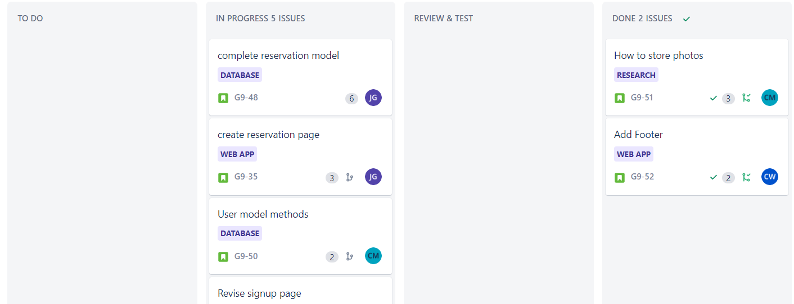
### Questions for team discussion
* None

---
## 03/10/2023 - Scrum Master: Carter Watson
* No Meeting - Spring Break

---
## 03/08/2023 - Scrum Master: Carter Watson
* No Meeting - Spring Break

---
## 03/06/2023 - Scrum Master: Carter Watson
* No Meeting - Spring Break

---
## 02/27/2023 - Scrum Master: Carter Watson
### Team Notes
| Team Member   | Accomplishments from last standup | Plan for work until next standup | Roadblocks |
| ------------- | --- | --- | --- |
| Carter Watson | Absent |  |  |
| Caden Maxwell |  |  |  |
| Caleb Leavitt |  |  |  |
| Joseph Giles  |  |  |  |
### General Discussion
* Not sure the scope of the tickets at hand

---
## 02/24/2023 - Scrum Master: Carter Watson
### Team Notes
| Team Member   | Accomplishments from last standup | Plan for work until next standup | Roadblocks |
| ------------- | --- | --- | --- |
| Carter Watson | Worked on home page | Continue work on various pages | None |
| Caden Maxwell | Working on user profile page |  | None |
| Caleb Leavitt | Absent: Heading out of town |  |  |
| Joseph Giles  | Worked on few pages |  | Maybe need Models created |
### Screenshot of Burndown Chart
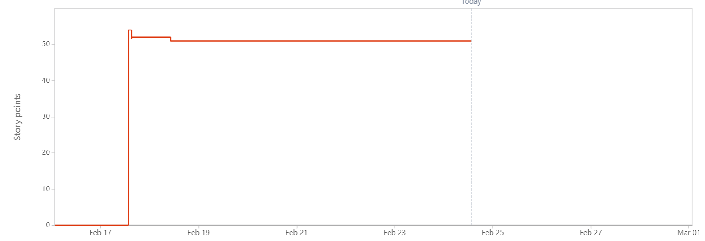
### Screenshot of Kanban Board
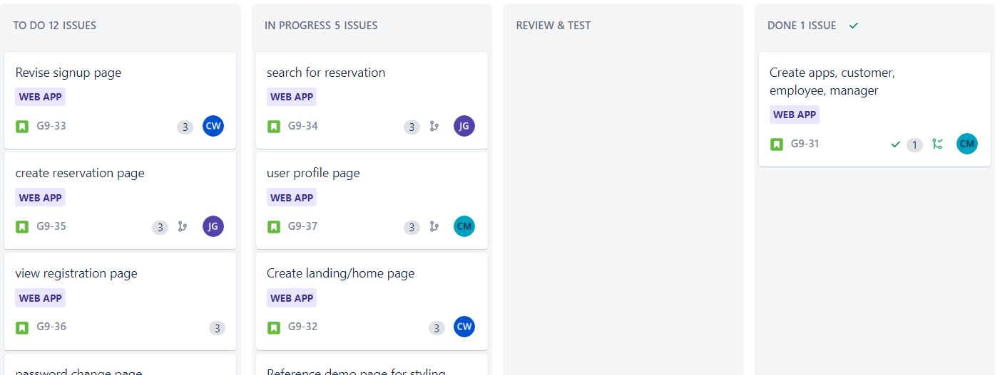
### Questions for team discussion
* None

---
## 02/22/2023 - Scrum Master: Carter Watson
### Team Notes
| Team Member   | Accomplishments from last standup | Plan for work until next standup | Roadblocks |
| ------------- | --- | --- | --- |
| Carter Watson | Looked into color schemes | finish demo page and a page or two | None |
| Caden Maxwell | Absent - Created apps |  |  |
| Caleb Leavitt | Absent: Ski day |  |  |
| Joseph Giles  |  |  |  |
### Screenshot of Burndown Chart

### Screenshot of Kanban Board

### Questions for team discussion
* Decide color scheme
  * first color scheme
### Action items to look into
* how to use interapp css file
* start work on some models

---
## 02/20/2023 - Scrum Master: Carter Watson
### Team Notes
* No Meeting - Presidents day

---
## 02/17/2023 - Scrum Master: Carter Watson
### Team Notes
* Created tickets
* Agreed to each attempt to complete 4-5

---
## 02/15/2023 - Scrum Master: UPDATE
### Team Notes
* No standup held, planning for next three sprints instead

---
## 02/13/2023 - Scrum Master: Carter Watson
### Team Notes
| Team Member   | Accomplishments from last standup | Plan for work until next standup | Roadblocks |
| ------------- | --- | --- | --- |
| Carter Watson | Created car and reservation UML diagram, finished up DB authorization stuff | N/A | None |
| Caden Maxwell | Created activity diagram | N/A | None |
| Caleb Leavitt | Created low fidelity prototypes | N/A | None |
| Joseph Giles  | Finished up low fidelty prototypes | N/A | None |
### Questions for team discussion
* Possibility of hosting the DB somewhere (heroku)?
  * No free options - ask in class tomorrow
### Screenshot of Burndown Chart

### Screenshot of Kanban Board

---
## 02/10/2023 - Scrum Master: Carter Watson
### Team Notes
| Team Member   | Accomplishments from last standup | Plan for work until next standup | Roadblocks |
| ------------- | --- | --- | --- |
| Carter Watson | Pushed the model for the user | get queries working for the user model | None |
| Caden Maxwell | PR for login page | Start on activity diagram | None |
| Caleb Leavitt | Finishing up low fidelty html diagrams, creating some paper ones | finishing up UML diagrams | Problems with linux and django  |
| Joseph Giles  | Creating Diagrams & Creating structure for the diagrams | Create some low fidelty diagrams | None |
### Questions for team discussion
* None
### Screenshot of Burndown Chart

### Screenshot of Kanban Board

---
## 02/08/2023 - Scrum Master: Carter Watson
### Team Notes
| Team Member   | Accomplishments from last standup | Plan for work until next standup | Roadblocks |
| ------------- | --- | --- | --- |
| Carter Watson | None | finish user model, continue work on backend | None |
| Caden Maxwell | Front end of login working | activity diagram | waiting on login DB to create accounts  |
| Caleb Leavitt | reread django docs & finished low fidelty prototype | enhancing lowfidelty prototype | None |
| Joseph Giles  | None | low-fidelty prototype (G9-24) | None |
### Questions for team discussion
* None
### Screenshot of Burndown Chart

### Screenshot of Kanban Board

---
## 02/06/2023 - Scrum Master: Carter Watson
### Team Notes
| Team Member   | Accomplishments from last standup | Plan for work until next standup | Roadblocks |
| ------------- | --- | --- | --- |
| Carter Watson | Started work on login w/ DB (G9-17) | Continue work on Login w/ DB (G9-17) | Should we use django authentication or create our own? |
| Caden Maxwell | Worked on front end login (G9-13) | Finish up front end login (G9-13) | Creating accounts (G9-16) blocked by DB setup |
| Caleb Leavitt | Started work on wireframe views (G9-12) | Finishing up wireframe views (G9-12) | Refamilizarizing self with django |
| Joseph Giles  | PR for User class diagram & activity diagram, looking for feedback on both | Start work on low fidelity prototype (G9-24) | What is required of low fidelity |
### Questions for team discussion
* None
### Screenshot of Burndown Chart

### Screenshot of Kanban Board

---
## 02/03/2023 - Scrum Master: Carter Watson
### Team Notes
| Team Member   | Accomplishments from last standup | Plan for work until next standup | Roadblocks |
| ------------- | --- | --- | --- |
| Carter Watson | None | Login Page interface with DB (G9-17) | None |
| Caden Maxwell | None | Activity diagram (G9-21) & Front end styling for login page (G9-13) | Creating accounts (G9-16) blocked by DB setup |
| Caleb Leavitt | None | Get the wireframe of view setup (G9-12) | None |
| Joseph Giles  | None | User class diagram (G9-18) & activity diagram (G9-22) & low fidelity prototype for "search for car" (G9-24) | None |
### Questions for team discussion
* None
### Screenshot of Burndown Chart

### Screenshot of Kanban Board

  
TEMPLATE

---
## DATE - Scrum Master: UPDATE
### Team Notes
| Team Member   | Accomplishments from last standup | Plan for work until next standup | Roadblocks |
| ------------- | --- | --- | --- |
| Carter Watson |  |  |  |
| Caden Maxwell |  |  |  |
| Caleb Leavitt |  |  |  |
| Joseph Giles  |  |  |  |
### Screenshot of Burndown Chart

### Screenshot of Kanban Board

### Questions for team discussion
* None

