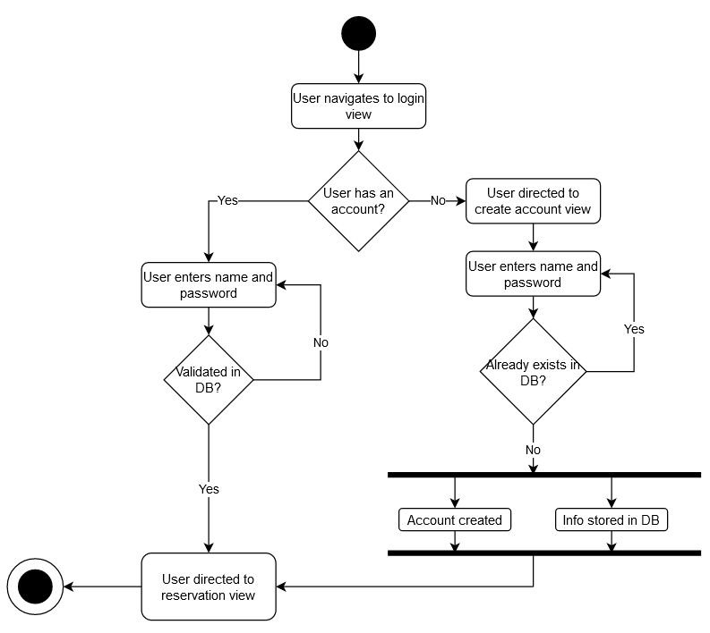
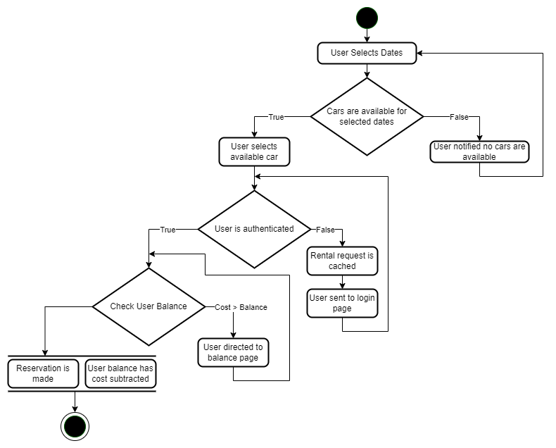
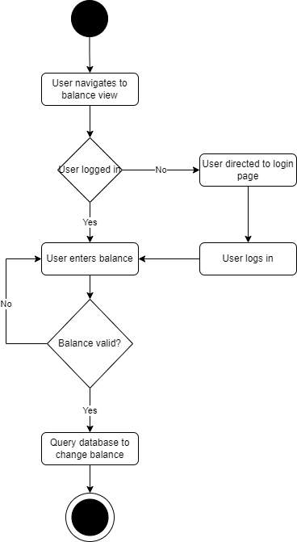

# Activity Diagrams

1. [Authentication](#Authentication)
2. [Reservation](#Reservation)
3. [Add Balance](#Add Balance)

**Symbol key**
1. Rounded Rectangle - An action or task
2. Diamond - A decision
3. Thick bar - The start or end of concurrent activities
4. Black circle - The start
5. Circled black circle - The end

**If one of the diagrams needs to be changed:**
1. Open the corresponding `figs/Activity.png` file online using [draw.io](https://draw.io)
2. Update the file as needed
3. Update this `README.md` if necessary

## Authentication

> User account authentication

### Actions/Tasks
- User navigates to login page
- User directed to account create view
- User enters name and password
- Info stored in database
- Account created
- User directed to reservation page

### Decision Roots
- User have existing account?
- User information validated in database?

## Reservation

> User creates reservation

### Actions/Tasks
- User selects dates
- User selects available car
- User logins in
- Reservation is made
- User balance has cost subtracted

### Decision Roots
- Cars are available for selected dates
- User is authenticate/logged
- User balance is greater than cost

## Add Balance

> User adds balance to account

### Actions/Tasks
- User navigates to balance page
- User enters balance amount
- System queries database to add balance to user account

### Decision Roots
- Is user logged in?
- Is balance valid?
