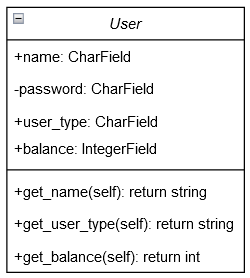

# Class UML Diagrams

1. [User](#User-Class)
2. [Car](#Car-Class)

## User Class

### Attributes:
- name: A public string field (Django's CharField)
- password: A private string field (Django's CharField)
- user_type: A public string field (Django's Charfield)
- balance: A public integer field (Django's IntegerField)

### Methods:
- get_name(self): return string for the name field
- get_user_type(self): return string for the user type
- get_balance(self): return integer for the dollar amount in user's balance