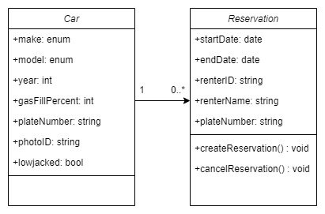

# Class UML Diagrams

1. [User](#User-Class)
2. [Car and Reservation](#Car-And-Reservation-Class)

## User Class

### Attributes:
* name: A public string field (Django CharField)
* password: A private string field (Django CharField)
* user_type: A public string field (Django Charfield)
* balance: A public integer field (Django IntegerField)

### Methods:
* get_name(self): return string for the name field
* get_user_type(self): return string for the user type
* get_balance(self): return integer for the dollar amount in user's balance

## Car And Reservation Class

  

### Attributes - Car Class
* make: make of car (Django CharField)  
* model: model of car (Django CharField)  
* year: year of car (Django IntegerField)  
* gasFillPercent: Percentage of gas left in the car (Django IntegerField)  
* plateNumber: license plate of car (Django CharField)  
* photoID: UUID of photo for car (Django CharField)  
* lowjacked: bool, true if the car is lowjacked, false if not (Django BooleanField)  

### Methods - Car Class
* None  

### Attributes - Reservation Class
* startDate: start date of reservation (Django DateField)  
* endDate: end date of reservation (Django DateField)  
* renterID: username of renter (Django CharField)  
* renterName: name of renter (Django CharField)  
* plateNumber: string of license plate of car to be rented (Django CharField)  

### Methods - Reservation Class
* createReservation() : void  
* cancelReservation() : void  
