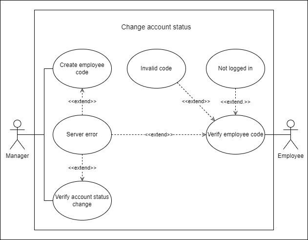

# Use Case Diagrams

1. [Customer makes reservation](#use-case-1)
2. [Customer picks up car](#use-case-2)
3. [Manager pays employees](#use-case-3)
4. [Login authentication](#use-case-4)
5. [Customer edits account balance](#use-case-5)
6. [Customer cancels rental](#use-case-6)
7. [Account creation](#use-case-7)
8. [Account modification](#use-case-8)

**If one of the diagrams needs to be changed:**
1. Open the corresponding `figs/UseCaseX.png` file online using [draw.io](https://draw.io)
2. Update the file as needed
3. Update this `README.md` if necessary

## Use Case 1

> Customer makes reservation

### Participating Actors:
- Customer

### Entry conditions:
- Customer wants to make a car reservation

### Exit conditions:
- Customer made car reservation
- Car no longer available for other customers on those reserved days

### Event flow:
1. Customer logs into the webpage
2. Customer searches for the car they want
3. System queries database for available cars matching search parameters
4. System displays available cars
5. Customer selects a car
6. System displays available dates for the car
7. Customer selects from available dates
8. System validates that customer has sufficient funds
9. System displays purchase confirmation and pick-up validation code

## Use Case 2

> Customer picks up car

### Participating Actors:
- Customer
- Till Operator

### Entry conditions:
- Customer needs to pick up the car that they rented on the website
- Customer has the validation code to pick up the car

### Exit conditions:
- Customer leaves with car

### Event flow:
1. Customer goes to rental place
2. Customer shows till operator the PIN/QR code/etc that was generated with online rental
3. Till operator enters code into system and validates rental
4. Till operator asks customer if they want insurance
5. Till operator (or someone else) gets car for customer
6. Till operator verifies that the car has been given out to the customer

## Use Case 3

> Manager pays employees

### Participating Actors:
- Manager

### Entry conditions:
- Manager needs to pay employees
- Employees have not been paid

### Exit conditions:
- Employees are paid
- Manager no longer needs to pay employees

### Event flow:
1. Manager logs in to website
2. Manager views employees hours
3. System checks database for employee hours
4. System displays employee hours
5. Manager verifies that employee hours are correct
6. Manager pays employees

## Use Case 4

> Login authentication

### Participating Actors:
- Customer
- Till operator
- Manager
- Any other employees

### Entry conditions:
- User needs to login to website
- User has valid username and password to access website

### Exit conditions:
- User is logged into website

### Event flow:
1. User goes to login page
2. User enters username and password
3. System checks username and password against database
4. System queries database for user status and preferences
5. System displays a webpage showing that user is logged in

## Use Case 5

> User transfers money to/from account

### Participating Actors:
- Customer
- Till operator
- Manager
- Any other employees

### Entry conditions:
- User wants to transfer money to/from account
- User has sufficient money to be transferred

### Exit conditions:
- User has more or less money in their account than before

### Event flow:
1. User goes to money transfer page
2. User enters the amount of money they want to transfer
3. User chooses whether they want to transfer to or from their bank account
4. User attempts to transfer money
5. System checks whether user has enough money to transfer
6. System displays confirmation that the money has been transferred

## Use Case 6

> Customer cancels rental

### Participating Actors:
- Customer

### Entry conditions:
- Customer wants to cancel rental
- Customer has one or more rentals to cancel

### Exit conditions:
- Customer cancels rental(s)
- Customer has one less active rental

### Event flow:
1. Customer logs into website
2. Customer goes to rental cancelling page
3. System queries database on the customer's active rentals
4. Customer selects one or more rentals to cancel
5. System updates database and displays cancellation confirmation

## Use Case 7

> Account creation

### Participating Actors:
- Customer
- Till operator
- Manager
- Any other employees

### Entry conditions:
- Some user needs to create an account

### Exit conditions:
- User has created an account
- User info has been entered into database

### Event flow:
1. User goes to login page
2. User enters personal information
3. User creates username and password
4. System checks if username and password are valid
5. System adds personal info, username, and password to database
6. User is able to login

## Use Case 8

> Account modification

### Participating Actors:
- Manager
- User

### Entry conditions:
- Manager needs to update an account to employee account

### Exit conditions:
- Regular user account is updated to employee account

### Event flow:
1. Manager logs into manager account
2. Manager goes to employee roster page and creates a random employee code
3. Employee logs into account
4. User goes to page to enter employee code
5. System checks code against manager-created one
6. System converts user account to employee account
