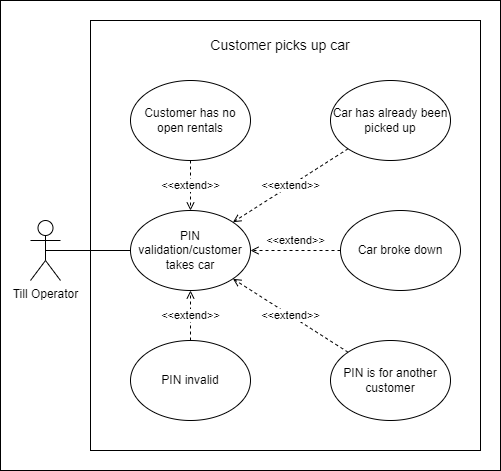
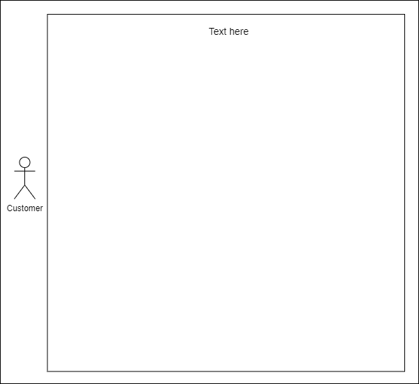
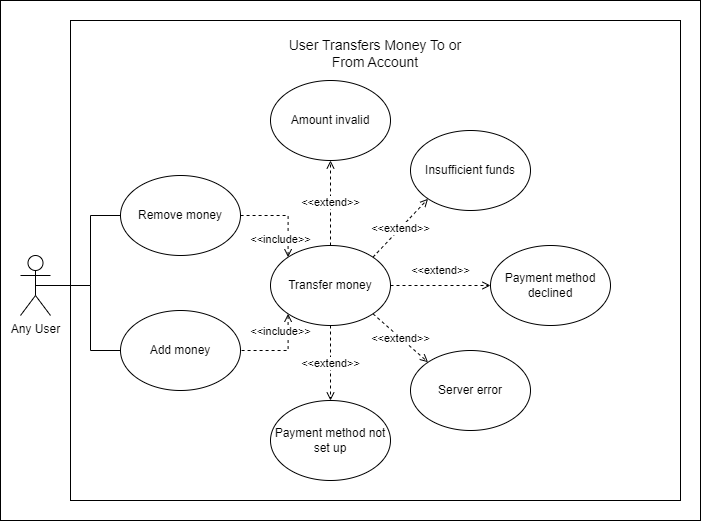
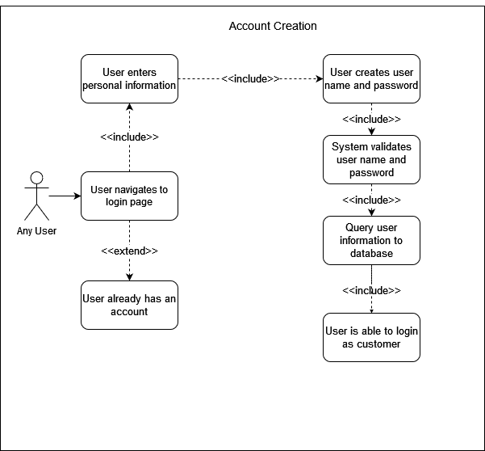

# Use Case Diagrams

1. [Customer makes reservation on a car](#use-case-1)
2. [Customer picks up car](#use-case-2)
3. [Manager goes to pay employees](#use-case-3)
4. [Login authentication for customers/employees](#use-case-4)
5. [Customer adds money to balance](#use-case-5)
6. [Customer cancels order](#use-case-6)
7. [Account creation/modification/deletion](#use-case-7)

**If one of the diagrams needs to be changed:**
1. Open the corresponding `figs/UseCaseX.png` file online using [draw.io](https://draw.io)
2. Update the file as needed
3. Update this `README.md` if necessary

## Use Case 1

> Customer makes a reservation on a car

Participating Actor: Customer

Entry conditions:
- Customer wants to make a car reservation

Exit conditions (mutually exclusive):
- Customer is able to make the reservation
    - Dates are available **and** the customer has sufficient funds
- Customer is unmable to make the reservation
    - Dates are unavailable **or** the customer has insufficient funds

Event flow:
1. Customer logs into the webpage
2. Customer searches for the car they want
3. System queries database for available cars matching search parameters
4. System displays available cars
5. Customer selects a car
6. System displays available dates for the car
7. Customer selects from available dates
8. System validates that customer has sufficient funds
9. System displays purchase confirmation and pick-up validation code

## Use Case 2

> Customer picks up car

Participating Actor: Actor

Entry conditions:
- Condition

Exit conditions (mutually exclusive):
- Condition

Event flow:
- Flow items

## Use Case 3

> Manager goes to pay employees

Participating Actor: Actor

Entry conditions:
- Condition

Exit conditions (mutually exclusive):
- Condition

Event flow:
- Flow items

## Use Case 4

> Login authentication for customers/employees

Participating Actor: Actor

Entry conditions:
- Condition

Exit conditions (mutually exclusive):
- Condition

Event flow:
- Flow items

## Use Case 5

> Customer adds money to balance

Participating Actor: Actor

Entry conditions:
- Condition

Exit conditions (mutually exclusive):
- Condition

Event flow:
- Flow items

## Use Case 6

> Customer cancels order

Participating Actor: Actor

Entry conditions:
- Condition

Exit conditions (mutually exclusive):
- Condition

Event flow:
- Flow items

## Use Case 7

> Account creation/modification/deletion

Participating Actor: Actor

Entry conditions:
- Condition

Exit conditions (mutually exclusive):
- Condition

Event flow:
- Flow items

